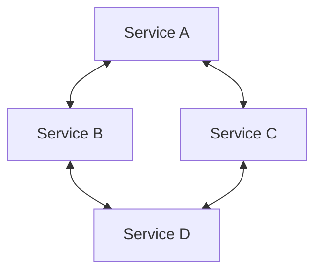
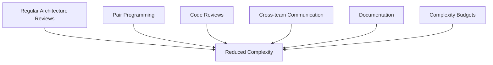

+++
date = "2024-08-18"
title = "Complexity Bombs in Distributed Systems: When 'Good Enough' Bites You"
categories = ["engineering", "software"]
tags = ["engineering", "software", "product development"]
type = "posts"
draft = true
+++

In many engineering organizations I've been part of, the drive for rapid
delivery often results in shortcuts and "good enough" solutions. When
managed effectively, this ability to quickly provide value can be a
significant competitive advantage. However, poor management or defaulting to
this approach can lead to what I call "complexity bombs" – ticking time
bombs of technical debt that explode into major issues as systems grow and
evolve. These can sometimes manifest unexpectedly, particularly in
distributed systems, causing sudden leaps in complexity.ystems.

## Understanding Complexity Bombs

Complexity bombs happen when the complexity of making changes or additions to a system, code base or application suddenly increases drastically over a short time. They often result from a lack of proper abstraction, tight coupling, and insufficient planning for future extensions.

Consider this diagram of how productivity, illustrated by features released over time can plummet as complexity increases:


As more features are added without proper architectural considerations, the system becomes increasingly difficult to maintain and extend.

## The "Good Enough" Trap

Let's look at an example of how "good enough" can lead to a complexity bomb. Imagine we're building a simple todo app:

```python
class TodoItem:
    def __init__(self, title, description):
        self.title = title
        self.description = description

class TodoApp:
    def __init__(self):
        self.items = []

    def add_item(self, item):
        self.items.append(item)

    def list_items(self):
        for item in self.items:
            print(f"{item.title}: {item.description}")
```

This seems fine for a basic todo app. But what happens when we want to add projects, or different types of items? The complexity quickly balloons:

```python
class Project:
    def __init__(self, name):
        self.name = name
        self.items = []

    def add_item(self, item):
        self.items.append(item)

class TodoApp:
    def __init__(self):
        self.items = []
        self.projects = []

    def add_item(self, item):
        self.items.append(item)

    def add_project(self, project):
        self.projects.append(project)

    def list_items(self):
        for item in self.items:
            print(f"{item.title}: {item.description}")
        for project in self.projects:
            print(f"Project: {project.name}")
            for item in project.items:
                print(f"  {item.title}: {item.description}")
```

## The Multiplier Effect of Dependencies

In distributed systems, the problem is compounded. Each service introduces its own complexities, and the interactions between services multiply these complexities. Here's a visualization:



//mermaid line chart showing the increase in complexity over time with each added service+feature
```mermaid
```

Each arrow represents a potential complexity multiplier. As the number of services and interactions grows, the complexity can quickly become unmanageable.

## Architecting for Change

To prevent complexity bombs, we need to architect our systems for change from the start. Let's refactor our todo app with this in mind:

```python
from abc import ABC, abstractmethod

class Item(ABC):
    @abstractmethod
    def display(self):
        pass

class TodoItem(Item):
    def __init__(self, title, description):
        self.title = title
        self.description = description

    def display(self):
        return f"{self.title}: {self.description}"

class Project(Item):
    def __init__(self, name):
        self.name = name
        self.items = []

    def add_item(self, item):
        self.items.append(item)

    def display(self):
        return f"Project: {self.name}\n" + "\n".join(item.display() for item in self.items)

class TodoApp:
    def __init__(self):
        self.items = []

    def add_item(self, item):
        self.items.append(item)

    def list_items(self):
        for item in self.items:
            print(item.display())
```

This design uses abstraction and polymorphism to create a more flexible system that can easily accommodate new types of items without changing the core `TodoApp` class.

## Team Collaboration to Defuse Complexity

One powerful way to prevent and defuse complexity bombs is through effective team collaboration. Here are some strategies:

1. **Regular Architecture Reviews**: Schedule frequent meetings where the team reviews the system architecture and discusses potential complexity issues.

2. **Pair Programming**: Implement pair programming sessions, especially when working on complex parts of the system. This helps spread knowledge and catch potential issues early.

3. **Code Reviews**: Enforce strict code review processes that not only look at functionality but also consider architectural implications and potential complexity increases.

4. **Documentation**: Maintain up-to-date documentation of the system architecture, including diagrams and explanations of design decisions.

5. **Cross-team Communication**: For distributed systems, ensure regular communication between teams responsible for different services. This can help identify and resolve inter-service complexity issues.

6. **Complexity Budgets**: Implement a "complexity budget" for each part of the system. When a component reaches its budget, it triggers a refactoring phase before new features can be added.

Here's a diagram illustrating this collaborative approach:



By fostering a culture of collaboration and communication, teams can work together to identify potential complexity bombs early and develop strategies to defuse them before they become major issues.

## Conclusion

While "good enough" solutions may seem appealing in the short term, they often lead to complexity bombs that can severely hinder a system's growth and adaptability. By prioritizing clean architecture, abstraction, and forward-thinking design, combined with strong team collaboration practices, we can create systems that remain flexible and maintainable as they evolve. Remember, the goal is to balance immediate needs with long-term sustainability, and this is best achieved through a collective effort of the entire development team.
